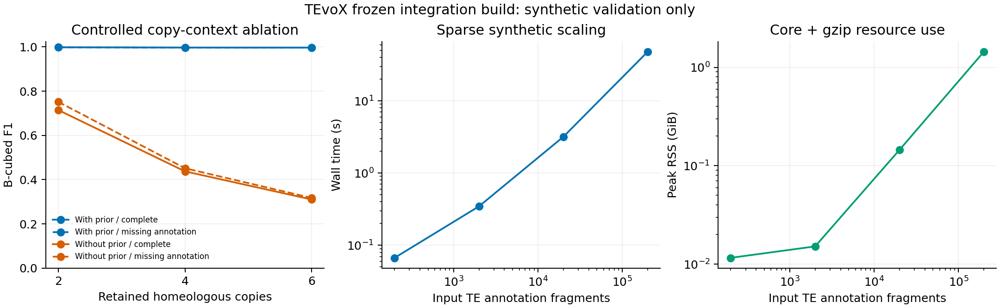

# TEvoX v0.5 整合修复与验证报告

本报告对应 [agent/v05-integration-20261005 分支](https://github.com/Wzhennan-icmm/TEvoX/tree/agent/v05-integration-20261005)，基于真正的 v0.5.0-alpha.2 开发版本 `3ba38b598ef3f1dacf7de2462276c683293735da`。程序仍标识为 `0.5.0-alpha.2`；这是整合验证版本，没有发布新的正式版本号。验证日期为 2026-10-06 UTC。完整证据索引见 [results/README.md](../studies/validation/results/README.md)。

五物种均使用同一个冻结可执行文件，SHA-256 为 `4211f2f1526a3c6a3e9417befb9b86d80c1869ca516825e98691c4e4e665c9e7`。原始旧版工作区及旧结果完整保留，最终分析目录为 `/workspace/tevox-v05-study/final/`。

## 验收结论

| 要求 | 本次结果 | 证据边界 |
|---|---|---|
| 极端非法 GFF 起点溢出 | 已修复并通过普通与 sanitizer 回归 | 非法坐标在减 1 前拒绝，包含 INT64_MIN |
| Hungarian 阈值措辞 | 已纠正 | 两侧节点数均不超过阈值才使用该精确匹配；不等于任一侧满足 |
| 目标 Linux 系统 | 9 个发行版用户空间均通过 | 容器共享宿主内核，不是 9 套独立内核启动测试 |
| Mac 适配 | Intel、Apple Silicon 原生 CI 与 Universal 打包通过 | 实测 macOS 15；deployment target 11 不等于实测所有 macOS 版本 |
| 五物种各一对已发表组装 | 最终版本全部完成，并核验与归档 | TE 注释片段及重建位点，不等于逐个独立插入事件 |
| 公开真值 | GIAB 外部缺失子集及公开小鼠 PCR 子集有可追溯评估 | 有选择偏差、材料和任务边界，不能外推全基因组准确率 |
| 概率校准 | 前置流程与阻断条件已检查；尚未拟合合格模型 | 缺少独立正负 candidate membership 标签、抽样框架和独立留出集 |
| 多倍体 | 36 次受控拷贝上下文与共线性消融完成 | 尚未完成独立生物学多倍体真值验证 |
| 规模测试 | 200–200,000 个合成 TE，另有约 919 万 TE 的真实人类输入 | 没有宣称超大群体、密集全互连或万样本规模已经验证 |

## 修复及流程改动

GFF 解析先验证 `start >= 1`、`end >= start`，再进行一基坐标转换；回归覆盖极小值、零、反向区间及极大值。上传报告的阈值段落已另存修订 Word 文档。程序文档统一说明 Hungarian 的双侧阈值条件。

真实基因组整合还发现并修复负链 PAF 的非对称插入/缺失投影：原生 `cg/cs` 操作按目标正向描述，需要转换成查询正向遍历，I/D 含义保持原样。新增不对称插入缺失回归。长 CIGAR 的索引优化以正负链全部 17 张 TSV 与线性实现逐字节一致为依据。输出按 locus 索引成员，避免逐 locus 扫描整个图。

当 TE 与侧翼的局部窗口完全处在插入缺口中，局部 identity 不可计算。输出现在同时写 `local_identity=.` 与 `identity_method=MISSING`；全局 EQX 不能作为局部 identity 可用的证据。该窗口原先已被判为 UNCALLABLE，此修复不改变推断判定。拟南芥全量 schema 核验已通过；全部五物种另外执行流式行数、状态门控及逐行 evidence 契约核验。

`--gzip-output` 直接流式生成 17 张压缩 TSV，核查压缩子进程退出码，失败不产生成功运行标记。公共 Python 读取器支持压缩表。配套流程冻结程序、源 FASTA/repeat/gene、源 PAF、规范化脚本和配置的 SHA-256；输入或缓存变化会拒绝继续复用。归档在验证无损恢复后才删除派生明文 FASTA/大表，保留原始压缩源及归档日志。

## 平台验证

以下各环境均完成严格警告编译、`make check`、安装与安装后回归，以及六个命令的可用性检查。CentOS 7 另建 Python 3.8.20，不替换系统 Python；构建前提供 zlib。完整运行命令、容器镜像 ID、源文件哈希和日志均已保存。平台矩阵覆盖 C 核心和随附公共命令；五物种全量分析在当前 Linux 云机执行，数据流程另有 Python 3.8/3.12 CI，未宣称在每个操作系统重复了全部大基因组分析。

| 系统 | 编译器（实际记录） | Python | 结果 |
| --- | --- | --- | --- |
| CentOS 7 | gcc (GCC) 4.8.5 20150623 (Red Hat 4.8.5-44) | Python 3.8.20 | PASS |
| CentOS 8 | gcc (GCC) 8.5.0 20210514 (Red Hat 8.5.0-4) | Python 3.8.8 | PASS |
| Rocky 8 | gcc (GCC) 8.5.0 20210514 (Red Hat 8.5.0-29) | Python 3.8.17 | PASS |
| Rocky 9 | gcc (GCC) 11.5.0 20240719 (Red Hat 11.5.0-14) | Python 3.9.25 | PASS |
| Rocky 10 | gcc (GCC) 14.3.1 20251022 (Red Hat 14.3.1-4) | Python 3.12.14 | PASS |
| Ubuntu 20.04 | gcc (Ubuntu 9.4.0-1ubuntu1~20.04.2) 9.4.0 | Python 3.8.10 | PASS |
| Ubuntu 22.04 | gcc (Ubuntu 11.4.0-1ubuntu1~22.04.3) 11.4.0 | Python 3.10.12 | PASS |
| Ubuntu 24.04 | gcc (Ubuntu 13.3.0-6ubuntu2~24.04.1) 13.3.0 | Python 3.12.3 | PASS |
| Ubuntu 26.04 | gcc (Ubuntu 15.2.0-16ubuntu1) 15.2.0 | Python 3.14.4 | PASS |

Mac 原生验证包含核心回归、Intel/ARM 原生包、Universal 双架构验证、ad-hoc 签名、解包后的安装与运行检查。本次修复了真实 Apple `lipo` 的参数顺序；早先模拟命令没有识别的错误已加入模拟回归。ad-hoc 签名不等于 Apple Developer ID 签名或公证。

[CI，运行 37499319980，提交 06ed75f](https://github.com/Wzhennan-icmm/TEvoX/actions/runs/37499319980)：success。

[Native macOS packages，运行 37499319996，提交 06ed75f](https://github.com/Wzhennan-icmm/TEvoX/actions/runs/37499319996)：success。

云内下载 GitHub artifact 时，Azure 存储域名被网络代理拒绝；这不影响 Mac runner 已完成的包内测试和上传，但本地没有虚构已下载的 Mac 二进制。可从上述成功运行页面的 Artifacts 下载。环境配置草稿记录了实际缺少的网络域名。

## 五物种来源和适配

| 物种 | A | B | 本次主要适配与限制 |
|---|---|---|---|
| 人 | CHM13 hTERT，GCA_009914755.4 | HG002 maternal，GCA_018852615.3，匹配 v1.1 注释 | 选 chr1–22 与 chrX；从 bigRmsk 恢复原始 RepeatMasker 片段和方向，不能把显示跨度当作一个 TE |
| 小鼠 | C57BL/6NJ，GCA_921999865.2 | CAST/EiJ，GCA_921999005.2 | v3 主核序列与对应注释；品系特异 repeat library 不保证完全一致，且组装有参考引导 scaffold |
| 大鼠 | BN/NHsdMcwi，GCF_036323735.1 GRCr8 | SHRSP/BbbUtx，GCF_021556685.1 | SHRSP 原始 repeat 注释去除 4,559,500 行完全相同的连续重复行，未合并不同片段 |
| 拟南芥 | Nyl-7，材料 6069 | Sq-1，材料 6966 | 作者 v2.1 组装、染色体选择、匹配 EDTA 与 gene 注释；跨材料以 classification 对齐，不能直接比较各自局部 family ID |
| 玉米 | B73，GCF_902167145.1 NAM-5.0 | Oh43，GCA_902167015.1 | 匹配 UCSC RepeatMasker；gene 为 AUGUSTUS 预测，不能称 NAM 高可信基因集；原低内存比对有覆盖偏差 |

来源依据包括：拟南芥 [Igolkina et al., DOI 10.1038/s41588-025-02293-0](https://doi.org/10.1038/s41588-025-02293-0)；小鼠 v3 来源 [Helmy et al., DOI 10.1016/j.xgen.2025.101074](https://doi.org/10.1016/j.xgen.2025.101074)，不能用 2018 年旧组装论文替代该版本的来源；SHRSP [DOI 10.1161/HYPERTENSIONAHA.122.20140](https://doi.org/10.1161/HYPERTENSIONAHA.122.20140)。逐文件下载 URL、版本、选择规则和校验值见随附 source manifests；下载、序列选择、bigRmsk 恢复及去重的原始脚本另附可初始化的源码快照。该输入准备快照执行了 68 项测试，其中 66 项通过、2 项因快照内不含 minimap2 可执行文件而跳过；实际五物种比对及最终运行另有完整证据。

已发表材料与下载版本都被记录，但不声称每个数据镜像和论文中的统计完全一致。小鼠 ENA v3 的 N50 与论文表格有差异，已保留版本限制。玉米输入保留的序列范围也不能概括为“仅核染色体”。

### 最终结果

| 物种 | 输入 TE 片段 | 重建 loci | A / B 空位点源片段 | 核心耗时（秒） | 峰值 RSS（GiB） |
| --- | --- | --- | --- | --- | --- |
| 人 | 9,189,437 | 4,802,303 | 929 / 872 | 748.69 | 17.57 |
| 小鼠 | 6,295,781 | 3,656,990 | 24,727 / 21,759 | 536.10 | 15.25 |
| 大鼠 | 6,019,240 | 3,242,422 | 11,053 / 10,669 | 504.56 | 11.97 |
| 拟南芥 | 48,010 | 40,617 | 317 / 317 | 11.53 | 0.26 |
| 玉米 | 2,244,994 | 1,636,553 | 7,048 / 7,012 | 320.25 | 6.02 |

A/B 差异列分别为“源 A/B 中的 TE 注释片段在另一个基因组中具有可报告空位点证据”的数量。它们不是群体频率，也不能直接解释成进化上的插入或删除方向；多个片段可能属于一个事件。loci 为重建位点，不能用不同物种的原始计数直接比较 TE 活性。

大鼠与玉米的最终重跑复用了已验证的 EQX 比对缓存：源 FASTA/PAF、转换脚本与无损恢复后的输出哈希逐项一致，`alignment-reuse.json` 记录完整来源。仅缓存不变的比对派生结果，TEvoX 推断与后处理均重新执行。

核心 17 张表及规范化 BED8 使用零基半开区间；候选导出与邻近基因表的 `start1/end1` 为一基闭区间，已在字段名和 QC 中声明，转为 BED 时需转换起点。

五组真实分析均为 DNA pair 模式。gene 注释已下载、绑定来源并用于候选邻近基因与重叠统计；它们没有作为 MCScanX 共线性先验输入核心，因此核心 `genes/copy_contexts=0` 是本次配置的预期结果。合成多拷贝评估另行检验了 MCScanX 输入。尤其玉米基因结果只适合描述候选位置，需替换成匹配的作者高可信 gene 注释后再作功能富集结论。

运行时间和 RSS 来自每次子进程 `wait4`，覆盖 TEvoX 分析及 gzip 写出，不包括源数据下载、全基因组比对、注释规范化和后处理。云任务存在并行工作，不是独占机器性能基准。最终压缩包及原始源的完整性核验见 `final-cohort-integrity.json`；五组均保留 `complete.json`、17 张 TSV、候选基因背景、运行参数与源文件哈希。

## 公开真值及校准边界

两套真值转移使用的源 FASTA 与 TE 注释哈希均已逐项核对为最终分析的相同输入，见 `truth-final-input-binding.json`；没有把不同版本的坐标直接拼接。

### 人：GIAB HG002

采用 [GIAB SV benchmark，PMID 32541955](https://doi.org/10.1038/s41587-020-0538-8) 的官方 HG002 Tier1 v0.6 VCF、v0.6.2 可信区间及 UCSC hg19↔hs1 双向 chain。预先限定 PASS、纯合 ALT、简单序列解析 DEL≥50 bp，含 50 bp 侧翼的 Tier1 覆盖，唯一无缺口互惠坐标转移，CHM13 REF 逐碱基完全一致，TE 覆盖≥95% 且缺失区间覆盖≥80%。纯合限定避免把未分相杂合位点当成 HG002 maternal 的确定缺失。

74,012 条 VCF 记录中，2,031 条为 PASS 纯合缺失；243 条通过严格转移筛选，最终得到 42 个 TE 片段。最终版本确认空位点 **41/42（97.62%）**，其余 1 个为 UNCALLABLE；阳性子集召回的 Wilson 95% 区间为 87.68%–99.58%。42 个标签均匹配到最终 decision，没有丢失判定行。

保留的未检出位点为 CHM13 chr1 `[82500685,82502190)`，GIAB ID `HG3_Ill_SVrefine2DISCOVARDovetail_450`。其技术原因是 `FLANK_SUPPORT_BELOW_THRESHOLD`，没有将其从分母删除。该子集只含已知缺失阳性，不能估计 precision、FDR 或 candidate membership 概率校准；独立 callset 不保证所有测序 reads 与组装输入独立。严格可转移筛选还偏向简单、参考相似区域。

### 小鼠：公开 PCR

使用 [Ferraj et al., PMID 37228752](https://doi.org/10.1016/j.xgen.2023.100291) 的 Table S2/S3。补充包从 Europe PMC 下载，已记录压缩包与表格哈希。论文报告常规 73 个 SV 和 15 个基因相关 SV；实际补充表的 88 行中存在 3 个重复 ID（其中一个使用另一组引物，CAST 判定一致），合计 85 个唯一 ID。重复记录保留审计，评价按唯一位点计数。PCR 标签与作者计算结果分列保留；`MERGE_SAMPLES` 不被当成 PCR 真值。该研究的独立长读长项目为 PRJNA923323，本次组装来源项目为 PRJEB47108。

B6 PCR 为 C57BL/6J，不能替代 C57BL/6NJ。筛选规则在检查 TEvoX 判定前固定：作者标记 TE 的 DEL、CAST PCR 明确为 0/1；在本次 NJ 组装中唯一、完整且逐碱基相同地找到 GRCm39 REF 加双侧 50 bp；随后应用与人类子集相同的 TE/DEL 覆盖阈值。这样 NJ 的参考等位基因由组装序列支持，CAST 的 SV 状态由 PCR 支持。CAST PCR=0 表示该 SV 不存在，只有通过该等位基因与 TE 对应关系后才解释为 TE PRESENT。

15 个候选 DEL 中，14 个通过唯一完整参考等位基因转移，1 个没有 exact transfer；其中 10 个 TE 片段满足覆盖条件（已知 EMPTY 8 个、PRESENT 2 个）。最终评价如下，未按结果调整筛选或阈值：

| PCR 预期 → TEvoX 可报告状态 | 片段数 |
| --- | --- |
| EMPTY->EMPTY | 8 |
| PRESENT->PRESENT | 2 |

全部 10 个标签都已匹配到 decision。不可报告的判定单列为 UNRESOLVED，保留在评价中。

这是小规模、经选择的状态评价集，不是全基因组随机抽样，也不为 C57BL/6NJ 补造 PCR 标签。CAST PCR 与本次组装按同品系对应，尚未证明来自同一只动物，需保留实验来源和品系内变异的限制。它仍然不提供两个候选 TE 是否同一位点的独立成员关系标签。

### 其他公开数据检索

玉米 [PMID 38134220](https://doi.org/10.1371/journal.pgen.1011086) 的 AnchorWave/panEDTA NAM 面板包含相关材料，可作为外部计算对照；其数据 [Dryad DOI 10.5061/dryad.5qfttdz9t](https://doi.org/10.5061/dryad.5qfttdz9t) 在本环境被代理拒绝，公开 GitHub 仓库主要提供分析脚本。panEDTA 与本次 RepeatMasker 的定义和 ID 也需先建立对应，不能直接称实验真值。

GraffiTE 的 [PMID 39414821](https://doi.org/10.1038/s41467-024-53294-2) 引用 GIAB TE 子集；其仓库内 `truth.bed` 实际是可信区域而不是逐位点 TE 标签，不能当作真假位点清单。小鼠 Zenodo 7644286 API 同样被代理拒绝；本次通过可访问的文章补充文件取得 PCR 表，未将未取得的全部 VCF 宣称完成。拟南芥、大鼠和真实多倍体的公开检索线索已记录，但尚未建立与本次材料和任务完全匹配的独立真值集合。

### 概率校准验收

当前继续使用 `BUILTIN_UNCALIBRATED_V1`，明确输出 `UNCALIBRATED`。已有训练导出与泄漏审计工具经回归验证，但这些工具存在不等于模型已校准。

正式校准尚缺：独立 `SAME_LOCUS/DIFFERENT_LOCUS` 标签、已知抽样框架、足够的正负候选、严格分开的开发/校准/测试集及 clade/species-pair 留出。五物种常规输出使用候选上限，不能直接作为无截断训练集；正式训练需同时设置 `--max-candidates 0 --max-graph-candidates 0` 并通过导出契约。空位点 PCR 正负标签只评价生物状态，不能自动转换成候选成员关系标签。本次没有训练或发布一个伪称已验证的概率模型，未完成项目详见 `calibration-readiness.json`。

## 多拷贝与规模评估

生成器先写祖先 locus 真值，再调用 TEvoX。36 次实验覆盖 2/4/6 个 homeologous copies、有/无缺失注释、3 个 seed、有/无 MCScanX 先验。拷贝数不是实验测得的细胞遗传学倍性；提供的 DNA 路径是精确的。随机种子改变序列字母，不改变几何关系，因此三组不能当作独立生物学重复。

| 保留的 homeologous copies | 缺失注释 | 有先验 B-cubed F1 | 无先验 B-cubed F1 |
| --- | --- | --- | --- |
| 2 | 无 | 0.998261 | 0.714286 |
| 2 | 有 | 0.998170 | 0.751425 |
| 4 | 无 | 0.997180 | 0.437500 |
| 4 | 有 | 0.997093 | 0.451565 |
| 6 | 无 | 0.996801 | 0.310345 |
| 6 | 有 | 0.996731 | 0.317468 |

三种 seed 的几何关系相同，表中对应指标一致；此处评价的是有注释节点的位点重建，不是缺失注释 TE 的发现率。

有先验时仍保留一个失败 locus：它跨中央 anchor，分类为 `BLOCK_INTERIOR` 而非严格 `BRACKETED`，导致保守拆分；没有为提高分数删除该位点。简单合成集上的 precision=1 不能解释成真实多倍体零假阳性。独立实验真值的生物学多倍体评价仍待完成。

| 输入 TE 片段 | 耗时（秒） | 峰值 RSS（GiB） | B-cubed F1 |
| --- | --- | --- | --- |
| 200 | 0.067 | 0.0116 | 1.0 |
| 2,000 | 0.346 | 0.0152 | 1.0 |
| 20,000 | 3.185 | 0.1450 | 1.0 |
| 200,000 | 48.111 | 1.4428 | 1.0 |



规模测试涵盖稀疏受控图；最大合成例产生 10,097,450 条 relations。另有约 919 万个 TE 注释片段的真实人类 pair，用于验证真实规模的运行与资源需求。尚未覆盖大型密集图、多群体全互连和所有多倍体注释条件；不能从本表外推普适线性复杂度。

## 复现与交付

源代码分支保留平台构建、数据适配、公开真值与独立评价脚本。详见 [五物种流程](../studies/published-genomes-v05/README.md)、[评价说明](../studies/validation/README.md) 和 [平台说明](PLATFORMS.md)。结果证据以机器可读 JSON、输入来源清单与 SHA-256 保存；大型基因组和全量 TSV 留在工作区，不加入 Git。

```sh
make -j2 && make check
make asan
python3 studies/published-genomes-v05/test_inputs.py
python3 studies/published-genomes-v05/test_run_integrity.py
python3 studies/validation/test_truth_mapping.py
python3 studies/validation/test_mouse_pcr_truth.py
python3 studies/validation/test_synthetic_metrics.py
```

当前工程验收与已执行的研究评价已形成可复查结果。正式概率校准和真实多倍体独立准确率仍是明确未完成的研究验收项；需要相应标签和材料后才能宣称完成。
